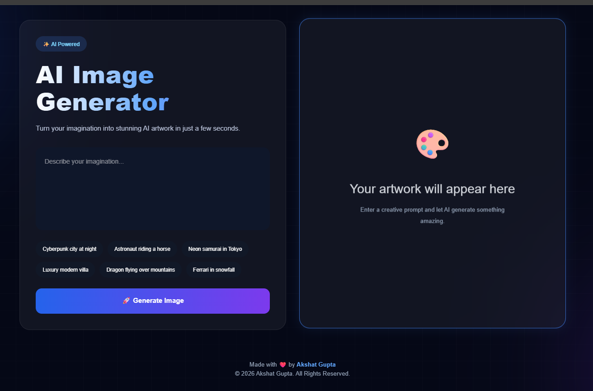
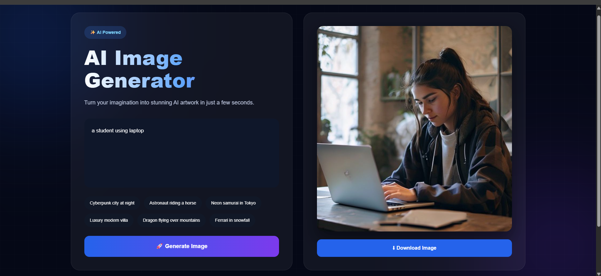

# 🎨 AI Image Generator

A modern **AI-powered Image Generator** built using **React, Vite, FastAPI, and Pollinations AI**. The application transforms text prompts into AI-generated artwork through a responsive cyberpunk-inspired interface with a seamless full-stack architecture.

## 🌐 Live Demo

🔗 **Live Website:** (https://ai-image-generator-theta-olive.vercel.app/)

📂 **GitHub Repository:** https://github.com/Ai-Image-Generator

---

## 📸 Screenshots

### 🏠 Home Page



### 🎨 Generated Image



---

# ✨ Features

- 🎨 Generate AI images from natural language prompts
- ⚛️ Modern React + Vite frontend
- ⚡ FastAPI backend with REST API
- 🤖 Integrated with Pollinations AI
- 💎 Cyberpunk-inspired UI with Glassmorphism
- 📥 One-click image download
- 💡 Prompt suggestion chips
- 📱 Fully responsive design
- 🌈 Animated gradients and glowing effects
- 🚀 Deployed on Vercel & Render

---

# 🛠 Tech Stack

### Frontend

- React.js
- Vite
- Axios
- CSS3

### Backend

- FastAPI
- Python
- Requests
- Pollinations AI API

### Deployment

- Vercel (Frontend)
- Render (Backend)

---

# 🏗️ Architecture

```
             User
               │
               ▼
      React + Vite Frontend
               │
         REST API (Axios)
               │
               ▼
      FastAPI Backend (Render)
               │
               ▼
       Pollinations AI API
               │
               ▼
       Generated Image
```

---

# 📂 Project Structure

```
AI-Image-Generator/
│
├── backend/
│   ├── main.py
│   ├── image_generator.py
│   ├── config.py
│   ├── requirements.txt
│   └── generated_images/
│
├── frontend/
│   ├── src/
│   ├── public/
│   ├── package.json
│   ├── vite.config.js
│   └── index.html
│
├── screenshots/
│   ├── home.png
│   └── generated.png
│
├── README.md
├── LICENSE
└── .gitignore
```

---

# ⚙️ Installation

## Clone Repository

```bash
git clone https://github.com/Ai-Image-Generator.git
cd AI-Image-Generator
```

---

## Backend Setup

```bash
cd backend

python -m venv venv
```

### Windows

```bash
venv\Scripts\activate
```

### Linux / macOS

```bash
source venv/bin/activate
```

Install dependencies:

```bash
pip install -r requirements.txt
```

Run the server:

```bash
uvicorn main:app --reload
```

---

## Frontend Setup

```bash
cd frontend

npm install

npm run dev
```

Visit:

```
http://localhost:5173
```

---

# 🚀 How It Works

1. Enter a creative text prompt.
2. Click **Generate Image**.
3. The frontend sends the prompt to the FastAPI backend.
4. The backend requests an image from Pollinations AI.
5. The generated image is returned and displayed instantly.
6. Download the generated image with one click.

---

# 🔮 Future Improvements

- User Authentication
- Image History
- Multiple AI Models
- AI Image Variations
- Image Upscaling
- Favorites Collection
- Dark / Light Theme
- Cloud Image Storage

---

# 👨‍💻 Author

**Akshat Gupta**

- GitHub: https://github.com/akshat-gupta15
- LinkedIn: www.linkedin.com/in/akshat-gupta-3910911bb

---

# 📄 License

This project is licensed under the **MIT License**.

---

## ⭐ Support

If you found this project helpful, please consider **starring the repository** on GitHub.
